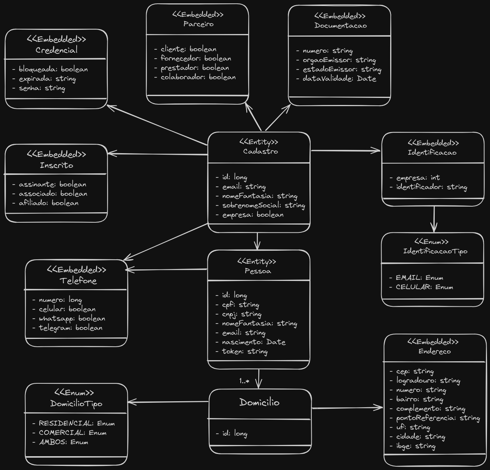

# Sobre o Projeto

O sistema de cadastro é uma API que permite o gerenciamento de cadastros de pessoas e empresas. Este sistema foi projetado para ser altamente flexível e escalável. A API suporta operações completas de CRUD (Create, Read, Update, Delete) para entidades como Cadastro e Pessoa, além de oferecer funcionalidades avançadas de validação e recuperação de endereços via CEP.

## Técnicas Utilizadas

- Clean Architecture
- Domain-Driven Design (DDD)
- Princípios SOLID

## Build Status
[](https://sonarcloud.io/summary/new_code?id=marcelinho_sistemadecadastro)
[](https://sonarcloud.io/summary/new_code?id=marcelinho_sistemadecadastro)
[](https://sonarcloud.io/summary/new_code?id=marcelinho_sistemadecadastro)
[](https://sonarcloud.io/summary/new_code?id=marcelinho_sistemadecadastro)
[](https://sonarcloud.io/summary/new_code?id=marcelinho_sistemadecadastro)

## Tecnologias Utilizadas


## Features

### CepServices:

- [x] Recuperar endereço por CEP.

### Cadastro:

- [x] Registrar.
- [ ] Recuperar todos.
- [ ] Recuperar por Id.
- [ ] Atualizar.
- [ ] Deletar.

### Pessoa:

- [x] Registrar.
- [ ] Recuperar todos.
- [ ] Recuperar por Id.
- [ ] Atualizar.
- [ ] Deletar.

## Estrutura do Projeto

Abaixo está um diagrama simplificado representando as principais entidades e seus relacionamentos dentro do sistema.



## Instalação

1. Clone o repositório: `git clone https://github.com/seu-usuario/sistemadecadastro.git`
2. Navegue até o diretório do projeto: `cd sistemadecadastro`
3. Restaure as dependências: `dotnet restore`
4. Configure a string de conexão com o banco de dados no arquivo `appsettings.json`.
5. Execute as migrações: `dotnet ef database update`
6. Inicie o projeto: `dotnet run`

## Uso

Após iniciar o projeto, você pode acessar a documentação da API através do Swagger, disponível em `https://localhost:7000/swagger`.

### Exemplos de Requisição

#### Registrar Cadastro

```json
{
  "email": "cadastro@exemplo.com",
  "nomeFantasia": "Nome Fantasia Cadastro",
  "sobrenomeSocial": "Sobrenome Social Cadastro",
  "empresa": true,
  "credencial": {
    "bloqueada": false,
    "expirada": "2024-12-31T23:59:59Z",
    "senha": "senha123"
  },
  "inscrito": {
    "assinante": true,
    "associado": false,
    "senha": "senha123"
  },
  "parceiro": {
    "cliente": true,
    "fornecedor": false,
    "prestador": false,
    "colaborador": true
  },
  "documento": {
    "numero": "123456789",
    "orgaoEmissor": "SSP",
    "estadoEmissor": "SP",
    "dataValidade": "2030-12-31T00:00:00Z"
  },
  "identificador": {
    "empresa": 1,
    "identificador": "Identificador",
    "tipo": 0
  }
}
```

#### Registrar Pessoa

```json
{
  "cpf": "12345678901",
  "cnpj": "12345678000195",
  "nome": "João Silva",
  "nomeFantasia": "João Silva ME",
  "email": "joao.silva@exemplo.com",
  "nascimento": "1980-01-01T00:00:00Z",
  "token": 12345,
  "domicilios": [
    {
      "tipo": 0,
      "endereco": {
        "cep": "16016020",
        "numero": "123",
        "complemento": "Apt 1",
        "pontoReferencia": "Próximo ao mercado"
      }
    },
    {
      "tipo": 1,
      "endereco": {
        "cep": "07241035",
        "numero": "456",
        "complemento": "Sala 5",
        "pontoReferencia": "Próximo ao shopping"
      }
    }
  ],
  "telefone": {
    "numero": 11987654321,
    "celular": true,
    "whatsapp": true,
   

 "telegram": false
  },
  "cadastro": {
    "email": "cadastro@exemplo.com",
    "nomeFantasia": "Nome Fantasia Cadastro",
    "sobrenomeSocial": "Sobrenome Social Cadastro",
    "empresa": true,
    "credencial": {
      "bloqueada": false,
      "expirada": "2024-12-31T23:59:59Z",
      "senha": "senha123"
    },
    "inscrito": {
      "assinante": true,
      "associado": false,
      "senha": "senha123"
    },
    "parceiro": {
      "cliente": true,
      "fornecedor": false,
      "prestador": false,
      "colaborador": true
    },
    "documento": {
      "numero": "123456789",
      "orgaoEmissor": "SSP",
      "estadoEmissor": "SP",
      "dataValidade": "2030-12-31T00:00:00Z"
    },
    "identificador": {
      "empresa": 1,
      "identificador": "Identificador",
      "tipo": 0
    }
  }
}
```

## Autores

Estes projetos de exemplo foram criados para fins educacionais. [Marcelo](https://github.com/Mmarcelinho) é responsável pela criação e manutenção destes projetos.

## Licença

Este projetos não possuem uma licença específica e são fornecidos apenas para fins de aprendizado e demonstração.
